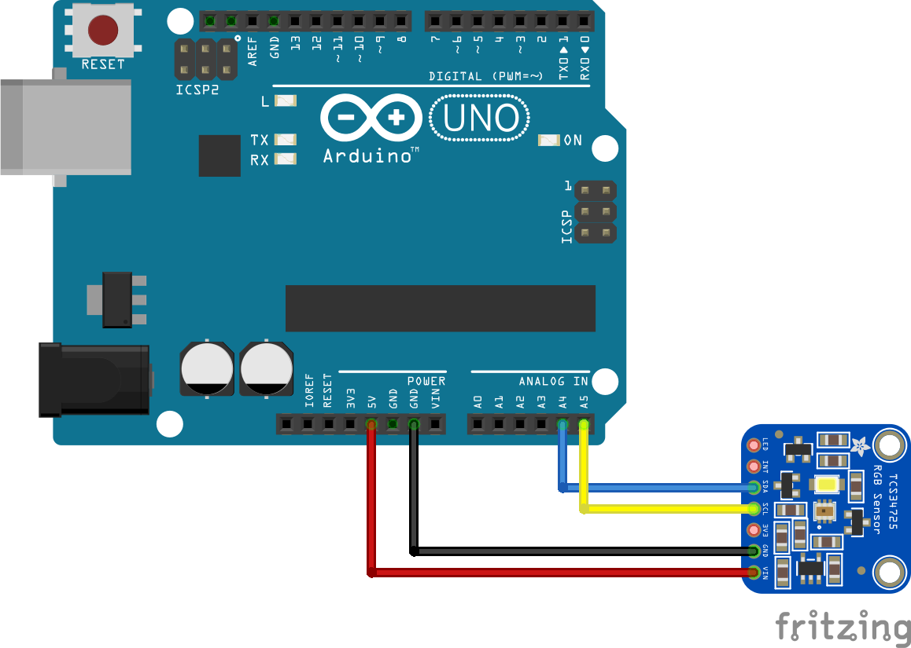

# TCS3472 Arduino
 Library for [TCS3472](https://www.biomaker.org/block-catalogue/2021/12/17/rgb-colour-sensor-tcs34725) color sensor for Hogeschool Utrecht ICT by @koolstofmonoxide.

# About
Library that reads the RGB value using the TCS3472 color sensor, with examples. Uses the I2C protocol.

# Wiring

By @jose2396trino at [Arduino forums](https://europe1.discourse-cdn.com/arduino/original/4X/7/d/d/7dd53264d3f8e0a8da0445c3f09b6d0e12c4e392.png).

# Example
To make [example](./src/example/example.ino) work, add an I2C LCD-screen (in my case a 2x16). Connect SDA to A4 on the Arduino, and connect SCL to A5 on the Arduino. Both I2C devices can be connected onto the same pins.

# Sources
- [Datasheet TCS3472](https://cdn-shop.adafruit.com/datasheets/TCS34725.pdf)
- [LiquidCrystal I2C library](https://github.com/johnrickman/LiquidCrystal_I2C)
- [RGB to color formula](https://dev.to/manishgs/find-closest-rgb-component-from-a-given-color-5hg1)